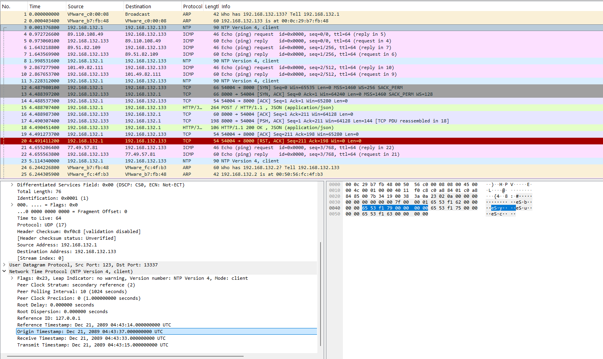

# Alright. Paradox time

To maintain a constant testing cycle, I simulate daylight at all hours and add adrenal
vapor to your oxygen supply. So you may be confused about the passage of time. The point 
is, yesterday was your birthday. I thought you'd want to know.

<sub>
*The pcap file contains a flag for each of the following challenges: "There will be cake", "Are you still there?", "Alright. Paradox time", and "Corrupted Cores". <br>
If the flag you found doesn't work, then it most likely belongs to one of the other 3 challenges.
</sub>

Hint: What protocol is associated with time?


<hr>

## Writeup

The challenge title and description are hinting that this challenge will have something to do with time. After looking
through the packet capture again, you decide to do some research into the NTP protocol. You discover that NTP is a 
protocol designed to help synchronize time across multiple computers within a few milliseconds of each other.
After doing some more research, you learn that each NTP packet has 4 separate timestamps, the reference timestamp (which
keeps track of when the server last synced), the origin timestamp (when the client sent the request), the receive 
timestamp (when the server received the request), and the transmit timestamp (when the server sent the reply). 
After doing this research, you decide to look at the various NTP packets and their timestamps.



Upon further inspection, you noticed that the timestamps all shared the same date, December 21st, 2089. This seems 
off, since 2089 is roughly 60 years in the future. Additionally, you notice that the origin timestamp of the first 
packet had a time of 04:43:37 while the receive timestamp had a time of 04:43:33. This should be impossible, as the
server can't receive a packet before it's been sent out. Its almost as if there was some sort of time paradox (no I'm
not sorry for doing that). After looking at more packets, you notice that they all have their time set somewhere around 
04:43:00, which is even weirder.

After looking at the octets for the timestamps, you notice they all start with 65 53 f1 and end with 4 octets of zeros, 
leaving a single octet that varies across each timestamp. These varying octets are also always associated with an ascii 
value, and combining the 4 varying octets within the first NTP packet ends up spelling "byuc", similarly to what we saw
in challenge "Are You Still There?". 

From here we take a similar where we can either write down the characters associated with the octets and combine them 
to get the flag, or we can write a script to do it for us. Below is a script you can use to solve this challenge. It 
uses the same 2 functions from the "Are You Still There?" challenge, which I moved to its own dedicated file (ParsePcap.py).
This script can also be found in the NTPTimeSolver.py file.

```python
from ParsePcap import *

PCAP_FILE  = "GLaDOS_Network.pcapng"
BASE_TIME  = 0x6553f100  # fixed value found at the start of each NTP timestamp


def solve_ntp(filepath):
    packets = parse_pcapng(filepath)

    flag_bytes = []

    for pkt in packets:
        result = parse_ip(pkt)
        if not result:
            continue
        proto, payload = result

        if proto != 17 or len(payload) < 8:  # UDP
            continue

        dport    = struct.unpack_from('>H', payload, 2)[0]
        udp_data = payload[8:]

        if dport != 13337 or len(udp_data) < 48:  # NTP packets sent to port 13337
            continue

        # NTP timestamp fields (each 8 bytes: 4 sec + 4 frac)
        # ref=offset 16, orig=offset 24, recv=offset 32, sent=offset 40
        ref_sec  = struct.unpack_from('>I', udp_data, 16)[0]
        orig_sec = struct.unpack_from('>I', udp_data, 24)[0]
        recv_sec = struct.unpack_from('>I', udp_data, 32)[0]
        sent_sec = struct.unpack_from('>I', udp_data, 40)[0]

        # Subtract base_time to recover encoded flag bytes
        flag_bytes += [
            ref_sec  - BASE_TIME,
            orig_sec - BASE_TIME,
            recv_sec - BASE_TIME,
            sent_sec - BASE_TIME,
        ]

    if not flag_bytes:
        print("No NTP packets found.")
        return

    flag = bytes(b for b in flag_bytes if b != 0)
    print(f"Flag: {flag.decode(errors='replace')}")


if __name__ == "__main__":
    solve_ntp(PCAP_FILE)
```

after running this script, you should get the following flag:  byuctf{S0_My_P4r4d0x_!d34_D!dnt_W0rk}


#### note:

This challenge was based off of the exfiltration tool developed by evallen: https://github.com/evallen/ntpescape

Since using this tool for the challenge would have made it near impossible to figure it out, I decided to use a similar
method where the exfiltration was a bit more obvious.