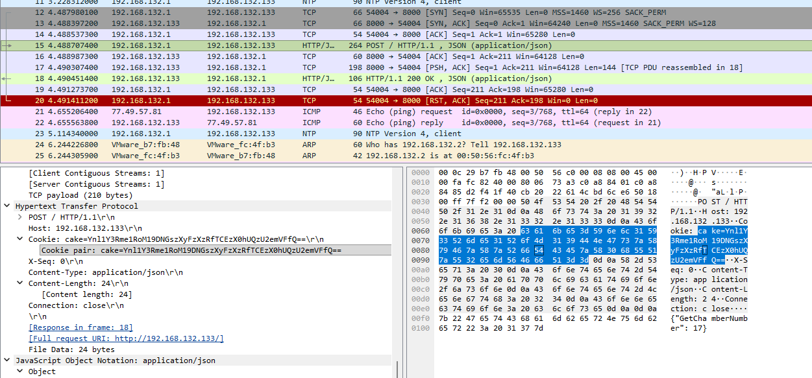

# There will be cake

## Challenge Description

The Enrichment Center is required to remind you that
all test subject activity will be logged, 
analyzed, and stored for scientific purposes.

"Cake and grief counseling will be available at the conclusion of the test."

*The pcap file contains a flag for each of the following challenges: "There will be cake", "Are you still there?", "Alright. Paradox time", and "Corrupted Cores".  
If the flag you found doesn't work, then it most likely belongs to one of the other 3 challenges.

Hint: what is a baked treat similar to a cake that you can find on almost any website?

## Writeup

This one is fairly straightforward. Since the challenge description is talking about storing data, the
player should look for any packets that resemble an API request. The only packets that fit this description 
are the HTTP request and response packets, so we start our search there.

After looking around in the HTTP request packet, we see that there is a cookie being sent titled cake, which has
a base64 string associated with it. If we take the base64 string and decode it, we end up with the following flag:

byuctf{Th3_C4k3_!s_4_L!3_HTC56zeE}

(also, please forgive me for the vibe-codded api. I only noticed after the fact that it was a POST request and not a 
GET request lol)